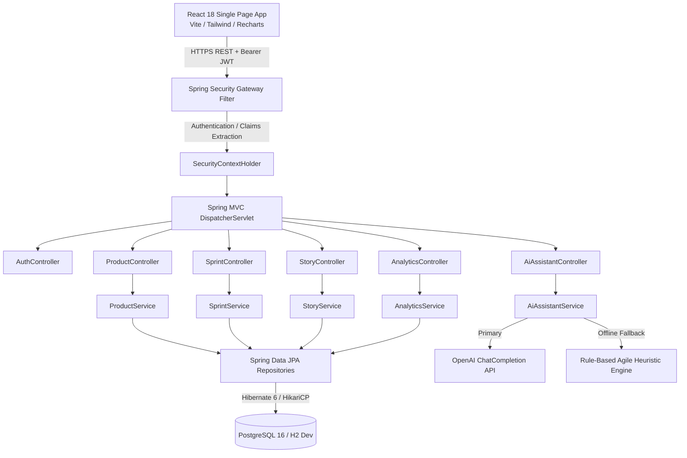
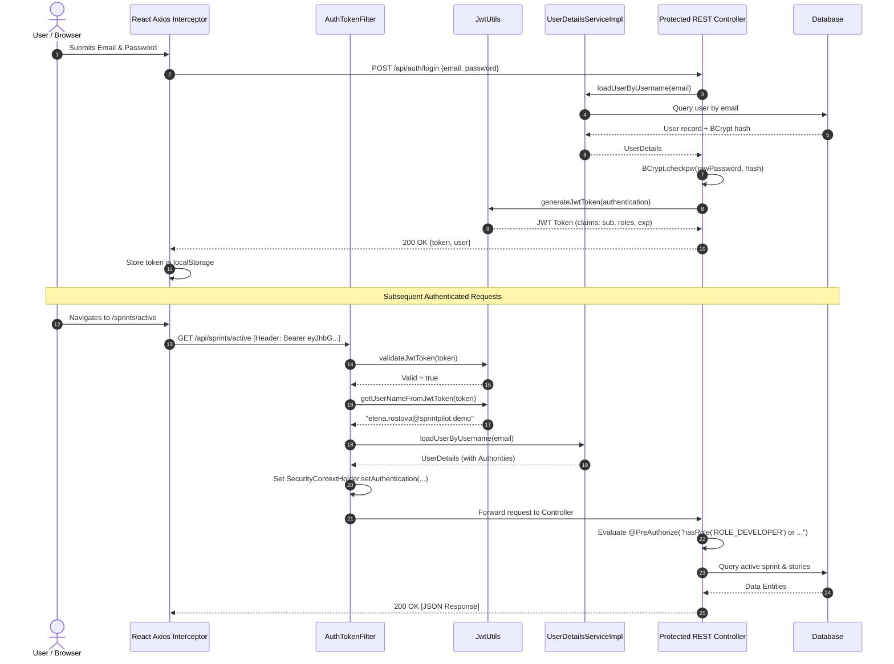
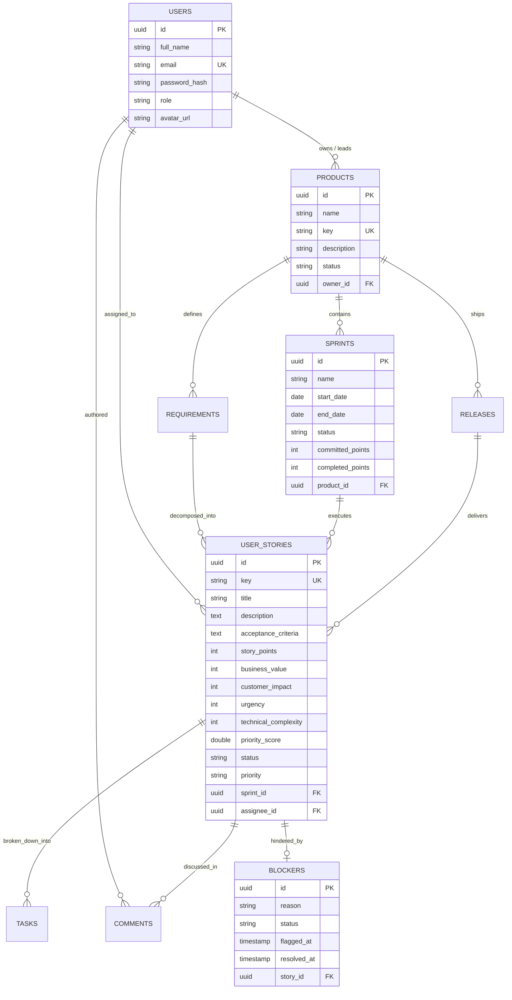

# 🏛️ SprintPilot System Architecture & Design Specification

This document details the architectural design, security model, data topologies, and engineering trade-offs of the **SprintPilot** platform.

---

## 1. System Overview & Component Topology

SprintPilot is architectured as a decoupled, single-tenant SaaS application separating client presentation from business orchestration and persistence:



---

## 2. Authentication & Authorization Lifecycle

SprintPilot employs **Stateless JSON Web Tokens (JWT)** with HMAC-SHA256 signature verification.



### Role-Based Access Control Matrix

| Controller / Action | Method | Required Roles | Rationale |
| :--- | :--- | :--- | :--- |
| Create Product | `POST /api/products` | `ROLE_ADMIN`, `ROLE_PRODUCT_MANAGER` | Product roadmaps require strategic management privileges. |
| Create Sprint | `POST /api/sprints` | `ROLE_ADMIN`, `ROLE_PRODUCT_MANAGER` | Sprints represent delivery commitments scheduled by PMs. |
| Move Story Status | `PUT /api/stories/{id}/status` | `ROLE_ADMIN`, `ROLE_PRODUCT_MANAGER`, `ROLE_DEVELOPER` | Engineers actively driving work update Kanban status. |
| Log / Resolve Blocker | `POST /api/stories/{id}/blocker` | `ROLE_ADMIN`, `ROLE_PRODUCT_MANAGER`, `ROLE_DEVELOPER` | Any team member executing can raise an impediment. |
| View Analytics | `GET /api/analytics/dashboard` | `ROLE_ADMIN`, `ROLE_PRODUCT_MANAGER`, `ROLE_DEVELOPER`, `ROLE_VIEWER` | Read-only visibility granted to all organizational stakeholders. |

---

## 3. Data Model & Entity Relationship Architecture



---

## 4. State Machines

### Sprint Lifecycle
```
[PLANNING] ──(startSprint)──> [ACTIVE] ──(completeSprint)──> [COMPLETED]
                                  │
                             (cancelSprint)
                                  ▼
                             [CANCELLED]
```
- **Constraint**: Only one sprint may be in `ACTIVE` state per product at any given time.
- **Completion Hook**: When a sprint moves to `COMPLETED`, all stories remaining in non-`DONE` status automatically return to the product backlog (`sprint_id = null`).

### User Story Kanban Lifecycle
```
[BACKLOG] ──(assign to active sprint)──> [IN_PROGRESS] ──(code review)──> [IN_REVIEW] ──(QA verified)──> [DONE]
    ▲                                          │                                │
    └──────────────────(reject/reopen)─────────┴────────────────────────────────┘
```

---

## 5. Engineering Trade-offs & Design Decisions

### 1. In-Memory H2 (Dev) vs PostgreSQL (Prod)
- **Decision**: Configured dual Spring profiles (`application-dev.properties` with H2 PostgreSQL mode vs `application-prod.properties`).
- **Trade-off**: Evaluators reviewing the repository locally can clone and launch immediately without configuring local database servers or credentials. Production configurations use PostgreSQL's native JSONB, connection pooling, and ACID guarantees.

### 2. Dual-Engine AI Assistant Architecture
- **Decision**: Implemented `AiAssistantService` with automatic heuristic regex fallback.
- **Trade-off**: External LLM APIs (OpenAI) can fail due to rate limits, expired keys, or latency. SprintPilot's offline NLP fallback extracts roles, actions, benefits, and Gherkin structures instantaneously without network calls, ensuring 100% demo reliability.

### 3. Stateless JWT vs Server-Side HTTP Sessions
- **Decision**: Stateless JWT tokens stored client-side in localStorage and transmitted via Authorization headers.
- **Trade-off**: Eliminates memory state on the backend, allowing horizontal scalability across containers without distributed session stores (Redis). Token invalidation relies on short expiration times (24h) and revocation lists for high-security environments.

### 4. Client-Side Mathematical Prioritization Previews
- **Decision**: Priority scores are computed both client-side (during story authoring slider adjustments) and recalculated server-side in the service layer.
- **Trade-off**: Provides instant visual feedback to product managers on the formula output without network round-trips, while the backend guarantees data integrity before committing to PostgreSQL.
